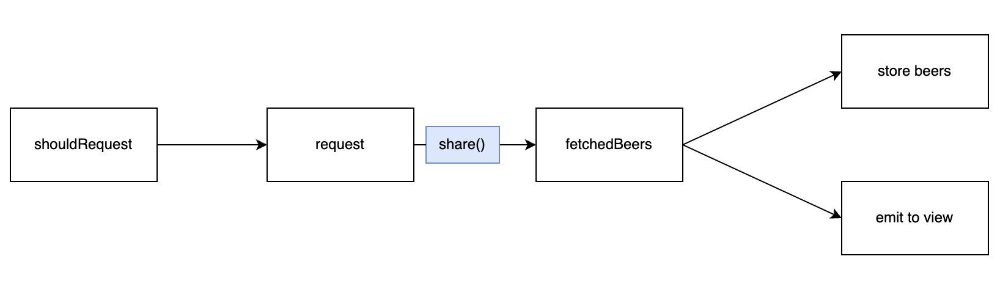

# UKBrewdogCatalogue

Brewdog's Catalogue in UIKit

## Project의 목적

* UIKit + RxSwift 의 공부
* 점진적으로 복잡한 UI를 구현해보는 것

## Step. 1

### 무엇을 만드는 가

[brewdog의 api](https://punkapi.com/documentation/v2)를 이용해 catalogue를 만들어 본다.


* CollectionView를 이용해서 만든다.
* 각 cell마다 thumnail과 이름이 표시되고 서버로 부터 이미지를 받지 못할 경우 대체 이미지를 띄운다.
* rxswift를 이용해 구현 할 것
* reacehd bottom 시 다음 page의 api를 추가 요청한다.

### 구현

#### ViewModel

Input과 Output 이다.

```swift
struct Input {
  var viewDidLoadTrigger: PublishRelay<Void>
  var loadCellsTrigger: PublishRelay<LoadAction>
}

struct Output {
  var fetchedBeers: Driver<[BeersSectionModel]>
}
```

* input
  * viewDidLoadTrigger: viewDidLoad가 감지되는 것을 알기 위한 트리거이다.
  * loadCellsTrigger: cell이 어떤 방식으로 로드가 되는지를 감지하기 위한 트리거이다. (load, loadmore, refresh)
* output
  * fetchedBeers: 만들어진 cellDataSource를 view쪽에 방출한다.


transform 이다.

우선 merge를 이용해 loadCellTrigger, viewDidLoadTrigger 의 이벤트를 받도록 한다.

```swift
let shouldRequest = Observable.merge(
  input.loadCellsTrigger.asObservable(),
  input.viewDidLoadTrigger
  .map{ LoadAction.load }.asObservable()
)
```

event가 시작되면 들어온 action에 따라 page를 달리하고 api를 호출한다.

특이한 점은 loadMore에서 numberOfItems를 받는데 이는 현재 collectionView에 item갯수를 의미한다. 아이템 갯수에 따라서 다음에 요청할 page를 결정한다.

```swift
let request = shouldRequest
      .withUnretained(self)
    // 밑에서 withLatestFrom을 통해 action을 받는게 싫다면 getBeers 호출 할 때 action을 넘기는 방법도 있음.
      .flatMapLatest { owner, action -> Observable<Beers> in
        switch action {
        case .load, .refresh:
          return owner.getBeers(currentPage: 1, perPage: owner.perPage)
        case .loadMore(numberOfItems: let numberOfItems):
          let page = numberOfItems / owner.perPage + 1
          return owner.getBeers(currentPage: page, perPage: owner.perPage)
        }
      }
      .share()
```

request-response가 제대로 됐다면 withLatestFrom으로 shouldRequest에 있는 action값을 스트림에 다시 추가해준다.

그리고 다시 withLatestFrom을 이용해 이제껏 저장해둔 beersRelay에서 beer값을 스트림에 추가해준다.

마지막으로 action에 따라 이전 값에 추가를 해줄지 새로 받은 값을 그대로 쓸지를 결정한다.

```swift
let fetchedBeers = request
      .catch({ error in
        return .empty()
      })
      .withLatestFrom(shouldRequest) { items, action in
        (action: action, items: items)
      }
      .withLatestFrom(self.beersRelay) { param, beers -> Beers in
        switch param.action {
        case .refresh:
          return param.items
        case .load, .loadMore:
          var oldValue = beers
          oldValue += param.items
          return oldValue
        }
      }
```


fetchedBeers에서 두갈래로 나뉘게 되는데 

* 받은 값을 beersRelay에 저장을 해주는 것.
* section model(cell data source) 을 생성해 view에 최종적으로 방출 해주는 것

```swift
// 저장
fetchedBeers
      .bind(to: self.beersRelay)
      .disposed(by: self.disposeBag)

// view
fetchedBeers
      .map(self.convertToBeersSectionModel(beers:))
      .withUnretained(self)
      .subscribe(onNext: { owner, beers in
        owner.beersSectionRelay.accept(beers)
      })
      .disposed(by: self.disposeBag)
```

저장 부분은 설명이 따로 필요 없을 것 같고

view 부분은 map 를 이용해 convertToBeersSectionModel 을 호출하고 Beers를 BeersSectionModel로 변형시켜 준다.

마지막으로 beersSectionRelay를 이용해 데이터 방출

위 transform의 과정을 그림으로 그리면 다음과 같다.



#### View

view는 아직 step.1 이라 그런지 별로 설명할게 없다.

이전에 내가 만들어 놓은 [Complex_CollectionViewtutorial-section,header,dynamicCellHeight(feat.RxDataSource)](https://github.com/dev-wimes/TIL/blob/master/Apple/UIKit/Complex_CollectionViewtutorial-section,header,dynamicCellHeight(feat.RxDataSource).md) 을 보면서 했다. 여기에 다시 적는 건 비효율적이라 적지 않겠다.


## Step 2


dynamic 셀 구현

누르면 크기에 맞춰서 커짐
다시 누르면 작아짐 
id, name, description, food pairing


uiflowlayout

```swift
// 추정값임 아래 Size는 얼마든지 동적으로 변경될 수 있으므로 크게 신경 쓸 필요가 없음
layout.estimatedItemSize = CGSize(width: self.view.frame.width/2 - 10, height: 50)
// @@ 이 내용도 한번 찾아서 적어놓기
layout.estimatedItemSize = UICollectionViewFlowLayout.automaticSize
```

preferredLayoutAttributesFitting

```swift
// @@ 이 내용도 한번 찾아서 적어놓자
// cell의 가로는 고정으로 준다. height가 가변임
//    let targetSize = CGSize(width: layoutAttributes.frame.width / 2 - 10, height: 0)
//    layoutAttributes.frame.size = self.contentView.systemLayoutSizeFitting(
//      targetSize,
//      withHorizontalFittingPriority: .required,
//      verticalFittingPriority: .fittingSizeLevel
//    )
```

HomeCollectionViewFlowLayout 를 설명할 필요가 있는지는 한번 생각해보자